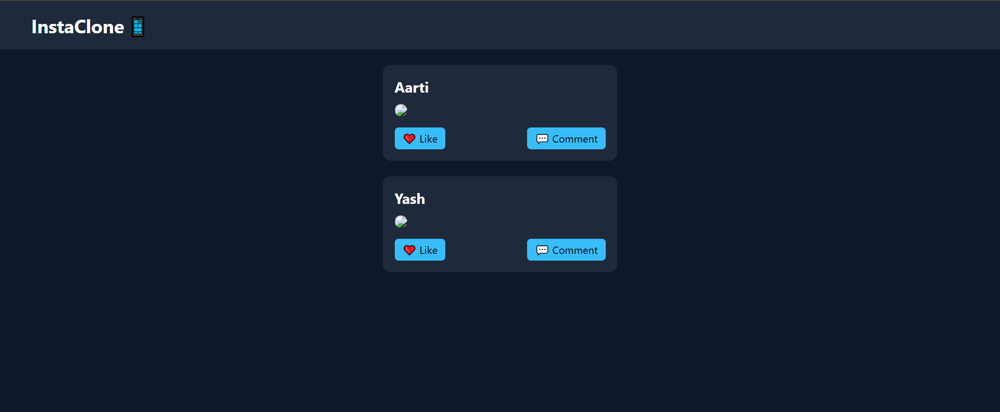

# 📱 Social Media UI - Day 1 Project 23

## 📌 Project Overview

This project is a modern **Social Media UI** created as part of my semester challenge to build 200 websites.

It represents a basic social media feed with posts, images, and interaction buttons like like and comment.

---

## 🎯 Features

* 📱 Social Media Feed Layout
* 🖼️ Post Image Display
* ❤️ Like Button
* 💬 Comment Button
* 🎨 Clean and Modern UI

---

## 🛠️ Technologies Used

* HTML5
* CSS3 (Flexbox)

---

## 📂 Project Structure

```id="k2m8z1"
site-23-social-media/
│
├── index.html
├── style.css
├── preview.png
└── README.md
```

---



---

## 💡 Learning Outcome

* Learned social media layout design
* Practiced feed-based UI structure
* Built interactive UI elements
* Improved UI/UX design skills
* Strengthened Git & GitHub workflow

---

## 🔥 Author

**Yash Patil**
Future Data Engineer 🚀

---

## ⭐ Note

This project is part of my goal to build **200 websites** to improve my web development and design skills.
